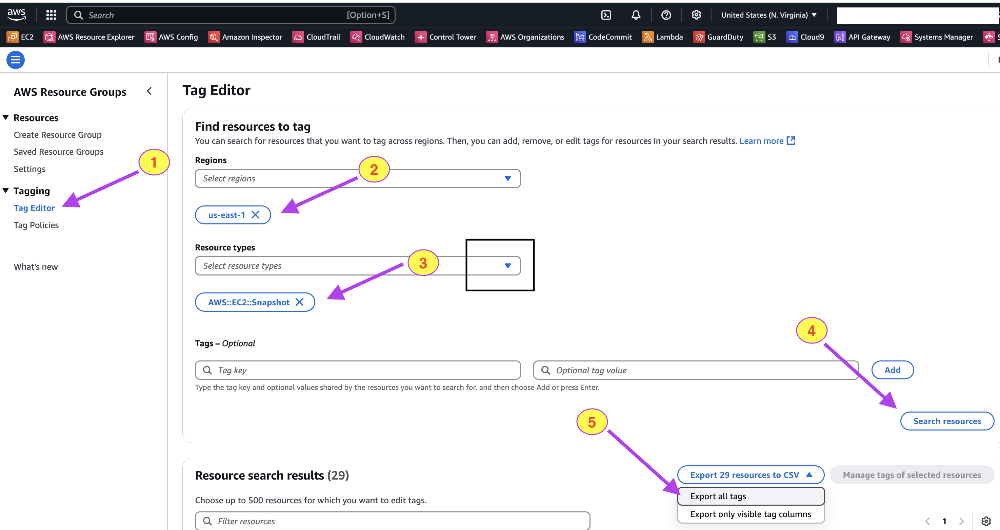

# Tag Manager

This script copies all the tags to Snapshots from their respective EC2 instances.

Before copying all the tags, its best practise to setup few Tag Policies & Service Control Policies as per your enterprise requirements. 

Tag Policy to define Tags & Value: It will make sure ec2 tags always use given name/value

* [TagPolicy/ec2creationTagstp.json](TagPolicy/ec2creationTagstp.json)

Service Control Policy to enforce EC2 instance always have given tags:
* [ServiceControlPolicy/ec2tagnodeletonscp.json](ServiceControlPolicy/ec2tagnodeletonscp.json)

Service Control Policy to enforce no deletion of given tags on EC2:
* [ServiceControlPolicy/ec2tagsenforcementscp.json](ServiceControlPolicy/ec2tagsenforcementscp.json)

THE SOFTWARE IS PROVIDED "AS IS", WITHOUT WARRANTY OF ANY KIND, EXPRESS OR
IMPLIED, INCLUDING BUT NOT LIMITED TO THE WARRANTIES OF MERCHANTABILITY,
FITNESS FOR A PARTICULAR PURPOSE AND NONINFRINGEMENT. IN NO EVENT SHALL THE
AUTHORS OR COPYRIGHT HOLDERS BE LIABLE FOR ANY CLAIM, DAMAGES OR OTHER
LIABILITY, WHETHER IN AN ACTION OF CONTRACT, TORT OR OTHERWISE, ARISING FROM,
OUT OF OR IN CONNECTION WITH THE SOFTWARE OR THE USE OR OTHER DEALINGS IN THE
SOFTWARE.

# Prerequisites 

First please make sure all EC2 instances are tagged propery.

Then download the list of all target snapshots which are going to be tagged. Follow steps below:

1. Go to AWS Resource Groups 
2. Click Tag Editor
3. Select your region
4. Select Resource types as `AWS::EC2::Snapshots`
5. Click Search resources
6. Click Export All tags

This will download a CSV file. Please rename that file to `resources.csv` and copy to this project folder.



## Setup Instructions

### 1. Install Python

Ensure Python is installed on your system. If not please install from following URL

[Python Download](https://www.python.org/downloads/)


### 2. Install pip

```bash
python3 -m ensurepip --upgrade
```

If Python is already installed, verify the pip installation:
```bash
python3 -m pip show pip
```

### 3. Install Required Packages
```bash
pip install pandas openpyxl boto3
```

### 4.  AWS Configuration
Update the following values in copytags.py (line numbers 6-8):
```bash
aws_access_key_id='ACCESS_KEY'
aws_secret_access_key='SECRET_ACCESS_KEY'
region_name='REGION'
```


## Magic Time - Tag the Snapshots
Run the following Script to tag all snapshots in the resource.csv file with the tags from their root EC2,
Execute the following command:
```bash
% python3 copytags.py
```

Verify the tags should be copied from parent EC2 to snapshots

> Note : It is recommended to use environment variables or AWS credentials file instead of hardcoding AWS credentials in the script.